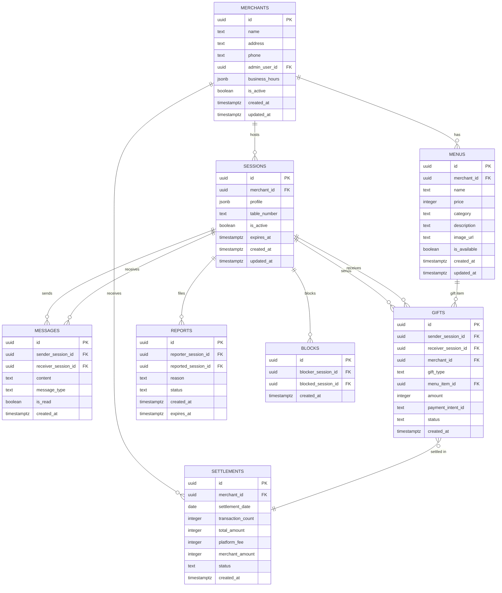

# Database Design (데이터베이스 설계)

# Table Connect - 데이터베이스 설계 (Database Design)

**버전:** v1.0

**작성일:** 2026년 1월 18일

**DBMS:** PostgreSQL 15+ (Supabase)

**참조 문서:** PRD v1.0, TRD v1.1

---

## 1. 개요

본 문서는 Table Connect의 데이터베이스 스키마 설계를 정의합니다. Supabase PostgreSQL을 기반으로 하며, Realtime, Row Level Security (RLS), Auth 기능을 활용합니다.

---

## 2. ERD (Entity Relationship Diagram)



---

## 3. 테이블 상세 설계

### 3.1 merchants (가맹점)

**목적:** 가맹점 정보 관리

```sql
CREATE TABLE merchants (
  id UUID PRIMARY KEY DEFAULT gen_random_uuid(),
  name TEXT NOT NULL,
  address TEXT,
  phone TEXT,
  admin_user_id UUID REFERENCES auth.users(id) ON DELETE SET NULL,
  business_hours JSONB DEFAULT '{}',
  -- {
  --   "monday": {"open": "17:00", "close": "02:00"},
  --   "tuesday": {"open": "17:00", "close": "02:00"},
  --   ...
  -- }
  is_active BOOLEAN DEFAULT true,
  subscription_plan TEXT DEFAULT 'basic', -- 'basic', 'premium'
  subscription_fee INTEGER DEFAULT 5000, -- ¥5,000
  created_at TIMESTAMPTZ DEFAULT NOW(),
  updated_at TIMESTAMPTZ DEFAULT NOW()
);

-- 인덱스
CREATE INDEX idx_merchants_active ON merchants(is_active) WHERE is_active = true;
CREATE INDEX idx_merchants_admin ON merchants(admin_user_id);

-- RLS 정책
ALTER TABLE merchants ENABLE ROW LEVEL SECURITY;

CREATE POLICY "Admins can view their own merchant"
ON merchants FOR SELECT
USING (auth.uid() = admin_user_id);

CREATE POLICY "Admins can update their own merchant"
ON merchants FOR UPDATE
USING (auth.uid() = admin_user_id);

```

**컬럼 설명:**

- `id`: 가맹점 고유 ID
- `name`: 매장명
- `address`: 주소
- `phone`: 전화번호
- `admin_user_id`: Supabase Auth 사용자 ID (관리자)
- `business_hours`: 영업시간 (JSON)
- `is_active`: 활성 여부
- `subscription_plan`: 구독 플랜
- `subscription_fee`: 월 구독료

---

### 3.2 menus (메뉴)

**목적:** 매장 메뉴 관리

```sql
CREATE TABLE menus (
  id UUID PRIMARY KEY DEFAULT gen_random_uuid(),
  merchant_id UUID NOT NULL REFERENCES merchants(id) ON DELETE CASCADE,
  name TEXT NOT NULL,
  price INTEGER NOT NULL CHECK (price > 0),
  category TEXT NOT NULL, -- 'drink', 'food', 'dessert'
  description TEXT,
  image_url TEXT,
  is_available BOOLEAN DEFAULT true,
  created_at TIMESTAMPTZ DEFAULT NOW(),
  updated_at TIMESTAMPTZ DEFAULT NOW()
);

-- 인덱스
CREATE INDEX idx_menus_merchant ON menus(merchant_id);
CREATE INDEX idx_menus_category ON menus(merchant_id, category) WHERE is_available = true;

-- RLS 정책
ALTER TABLE menus ENABLE ROW LEVEL SECURITY;

CREATE POLICY "Everyone can view available menus"
ON menus FOR SELECT
USING (is_available = true);

CREATE POLICY "Admins can manage their menus"
ON menus FOR ALL
USING (
  merchant_id IN (
    SELECT id FROM merchants WHERE admin_user_id = auth.uid()
  )
);

```

**컬럼 설명:**

- `merchant_id`: 가맹점 ID (FK)
- `name`: 메뉴명
- `price`: 가격 (엔화)
- `category`: 카테고리
- `description`: 설명
- `image_url`: 이미지 URL (Supabase Storage)
- `is_available`: 품절 여부

---

### 3.3 sessions (세션)

**목적:** 익명 사용자 세션 관리

```sql
CREATE TABLE sessions (
  id UUID PRIMARY KEY DEFAULT gen_random_uuid(),
  merchant_id UUID NOT NULL REFERENCES merchants(id) ON DELETE CASCADE,
  profile JSONB NOT NULL,
  -- {
  --   "gender": "male" | "female",
  --   "age_range": "20s_early" | "20s_mid" | "20s_late" | "30s_early" | ...,
  --   "party_size": 2,
  --   "nickname": "푸른사슴",
  --   "icon": "male_1"
  -- }
  table_number TEXT,
  is_active BOOLEAN DEFAULT true,
  warning_count INTEGER DEFAULT 0,
  expires_at TIMESTAMPTZ NOT NULL DEFAULT NOW() + INTERVAL '2 hours',
  created_at TIMESTAMPTZ DEFAULT NOW(),
  updated_at TIMESTAMPTZ DEFAULT NOW()
);

-- 인덱스
CREATE INDEX idx_sessions_merchant_active
ON sessions(merchant_id, is_active)
WHERE is_active = true;

CREATE INDEX idx_sessions_expires
ON sessions(expires_at)
WHERE is_active = true;

-- RLS 정책
ALTER TABLE sessions ENABLE ROW LEVEL SECURITY;

CREATE POLICY "Users can view active sessions in same merchant"
ON sessions FOR SELECT
USING (
  is_active = true AND
  merchant_id = (SELECT merchant_id FROM sessions WHERE id = auth.uid())
);

-- 세션 정리 함수 (Cron)
CREATE OR REPLACE FUNCTION cleanup_expired_sessions()
RETURNS void AS $$
BEGIN
  -- 만료된 세션 비활성화
  UPDATE sessions
  SET is_active = false
  WHERE expires_at < NOW() AND is_active = true;

  -- 관련 메시지 삭제
  DELETE FROM messages
  WHERE sender_session_id IN (SELECT id FROM sessions WHERE is_active = false)
     OR receiver_session_id IN (SELECT id FROM sessions WHERE is_active = false);

  -- 세션 삭제 (24시간 후)
  DELETE FROM sessions
  WHERE updated_at < NOW() - INTERVAL '24 hours' AND is_active = false;
END;
$$ LANGUAGE plpgsql;

```

**컬럼 설명:**

- `merchant_id`: 현재 매장 ID
- `profile`: 사용자 프로필 (JSON)
- `table_number`: 테이블 번호 (선택)
- `is_active`: 활성 여부
- `warning_count`: AI 필터 경고 횟수
- `expires_at`: 만료 시간 (기본 2시간)

---

### 3.4 messages (메시지)

**목적:** 익명 메시징 기록

```sql
CREATE TABLE messages (
  id UUID PRIMARY KEY DEFAULT gen_random_uuid(),
  sender_session_id UUID NOT NULL REFERENCES sessions(id) ON DELETE CASCADE,
  receiver_session_id UUID NOT NULL REFERENCES sessions(id) ON DELETE CASCADE,
  content TEXT NOT NULL CHECK (char_length(content) <= 200),
  message_type TEXT DEFAULT 'text', -- 'text', 'emoji', 'quick_reply'
  is_read BOOLEAN DEFAULT false,
  created_at TIMESTAMPTZ DEFAULT NOW()
);

-- 인덱스
CREATE INDEX idx_messages_receiver
ON messages(receiver_session_id, created_at DESC);

CREATE INDEX idx_messages_conversation
ON messages(sender_session_id, receiver_session_id, created_at DESC);

-- Realtime 활성화
ALTER PUBLICATION supabase_realtime ADD TABLE messages;

-- RLS 정책
ALTER TABLE messages ENABLE ROW LEVEL SECURITY;

CREATE POLICY "Users can view their own messages"
ON messages FOR SELECT
USING (
  sender_session_id = auth.uid() OR
  receiver_session_id = auth.uid()
);

CREATE POLICY "Users can send messages"
ON messages FOR INSERT
WITH CHECK (sender_session_id = auth.uid());

```

**컬럼 설명:**

- `sender_session_id`: 발신자 세션 ID
- `receiver_session_id`: 수신자 세션 ID
- `content`: 메시지 내용 (최대 200자)
- `message_type`: 메시지 타입
- `is_read`: 읽음 여부

---

### 3.5 gifts (선물)

**목적:** 선물 거래 기록

```sql
CREATE TABLE gifts (
  id UUID PRIMARY KEY DEFAULT gen_random_uuid(),
  sender_session_id UUID NOT NULL REFERENCES sessions(id) ON DELETE SET NULL,
  receiver_session_id UUID NOT NULL REFERENCES sessions(id) ON DELETE SET NULL,
  merchant_id UUID NOT NULL REFERENCES merchants(id) ON DELETE CASCADE,
  gift_type TEXT NOT NULL, -- 'menu_item', 'point'
  menu_item_id UUID REFERENCES menus(id) ON DELETE SET NULL,
  amount INTEGER NOT NULL CHECK (amount > 0),
  payment_intent_id TEXT UNIQUE, -- Stripe Payment Intent ID
  status TEXT DEFAULT 'pending', -- 'pending', 'completed', 'failed'
  created_at TIMESTAMPTZ DEFAULT NOW()
);

-- 인덱스
CREATE INDEX idx_gifts_receiver ON gifts(receiver_session_id, created_at DESC);
CREATE INDEX idx_gifts_merchant_date ON gifts(merchant_id, created_at DESC);
CREATE INDEX idx_gifts_payment ON gifts(payment_intent_id) WHERE payment_intent_id IS NOT NULL;

-- Realtime 활성화
ALTER PUBLICATION supabase_realtime ADD TABLE gifts;

-- RLS 정책
ALTER TABLE gifts ENABLE ROW LEVEL SECURITY;

CREATE POLICY "Users can view their gifts"
ON gifts FOR SELECT
USING (
  sender_session_id = auth.uid() OR
  receiver_session_id = auth.uid()
);

CREATE POLICY "Merchants can view their gifts"
ON gifts FOR SELECT
USING (
  merchant_id IN (
    SELECT id FROM merchants WHERE admin_user_id = auth.uid()
  )
);

```

**컬럼 설명:**

- `gift_type`: 선물 타입 (메뉴 or 포인트)
- `menu_item_id`: 메뉴 아이템 ID (메뉴 선물 시)
- `amount`: 금액 (엔화)
- `payment_intent_id`: PG사 거래 ID
- `status`: 거래 상태

---

### 3.6 settlements (정산)

**목적:** 가맹점 정산 관리

```sql
CREATE TABLE settlements (
  id UUID PRIMARY KEY DEFAULT gen_random_uuid(),
  merchant_id UUID NOT NULL REFERENCES merchants(id) ON DELETE CASCADE,
  settlement_date DATE NOT NULL,
  transaction_count INTEGER DEFAULT 0,
  total_amount INTEGER DEFAULT 0,
  platform_fee_rate DECIMAL(5,2) DEFAULT 15.00, -- 15.00%
  platform_fee INTEGER DEFAULT 0,
  merchant_amount INTEGER DEFAULT 0,
  status TEXT DEFAULT 'pending', -- 'pending', 'completed', 'paid'
  created_at TIMESTAMPTZ DEFAULT NOW(),
  UNIQUE(merchant_id, settlement_date)
);

-- 인덱스
CREATE INDEX idx_settlements_merchant_date
ON settlements(merchant_id, settlement_date DESC);

-- RLS 정책
ALTER TABLE settlements ENABLE ROW LEVEL SECURITY;

CREATE POLICY "Merchants can view their settlements"
ON settlements FOR SELECT
USING (
  merchant_id IN (
    SELECT id FROM merchants WHERE admin_user_id = auth.uid()
  )
);

-- 정산 집계 함수
CREATE OR REPLACE FUNCTION aggregate_daily_settlement(
  p_merchant_id UUID,
  p_date DATE
)
RETURNS void AS $$
DECLARE
  v_count INTEGER;
  v_total INTEGER;
  v_fee_rate DECIMAL;
  v_fee INTEGER;
  v_merchant_amt INTEGER;
BEGIN
  -- 해당 날짜의 거래 집계
  SELECT
    COUNT(*),
    COALESCE(SUM(amount), 0)
  INTO v_count, v_total
  FROM gifts
  WHERE merchant_id = p_merchant_id
    AND DATE(created_at) = p_date
    AND status = 'completed';

  -- 수수료율 가져오기 (초기 3개월은 10-12%, 이후 15-20%)
  SELECT
    CASE
      WHEN CURRENT_DATE < created_at + INTERVAL '3 months' THEN 12.00
      ELSE 17.50
    END
  INTO v_fee_rate
  FROM merchants
  WHERE id = p_merchant_id;

  -- 수수료 계산
  v_fee := FLOOR(v_total * v_fee_rate / 100);
  v_merchant_amt := v_total - v_fee;

  -- 정산 테이블 업데이트 또는 삽입
  INSERT INTO settlements (
    merchant_id, settlement_date, transaction_count,
    total_amount, platform_fee_rate, platform_fee, merchant_amount
  )
  VALUES (
    p_merchant_id, p_date, v_count,
    v_total, v_fee_rate, v_fee, v_merchant_amt
  )
  ON CONFLICT (merchant_id, settlement_date)
  DO UPDATE SET
    transaction_count = v_count,
    total_amount = v_total,
    platform_fee_rate = v_fee_rate,
    platform_fee = v_fee,
    merchant_amount = v_merchant_amt;
END;
$$ LANGUAGE plpgsql;

```

**컬럼 설명:**

- `settlement_date`: 정산 날짜
- `transaction_count`: 거래 건수
- `total_amount`: 총 거래액
- `platform_fee_rate`: 수수료율 (%)
- `platform_fee`: 플랫폼 수수료
- `merchant_amount`: 가맹점 정산 금액
- `status`: 정산 상태

---

### 3.7 reports (신고)

**목적:** 부적절한 행위 신고 관리

```sql
CREATE TABLE reports (
  id UUID PRIMARY KEY DEFAULT gen_random_uuid(),
  reporter_session_id UUID NOT NULL REFERENCES sessions(id) ON DELETE SET NULL,
  reported_session_id UUID NOT NULL REFERENCES sessions(id) ON DELETE SET NULL,
  reason TEXT NOT NULL, -- 'harassment', 'spam', 'inappropriate', 'other'
  details TEXT,
  status TEXT DEFAULT 'pending', -- 'pending', 'reviewed', 'actioned'
  session_snapshot JSONB, -- 신고 시점 세션 정보 스냅샷
  created_at TIMESTAMPTZ DEFAULT NOW(),
  expires_at TIMESTAMPTZ DEFAULT NOW() + INTERVAL '7 days'
);

-- 인덱스
CREATE INDEX idx_reports_status ON reports(status, created_at DESC);
CREATE INDEX idx_reports_expires ON reports(expires_at);

-- 만료된 신고 자동 삭제
CREATE OR REPLACE FUNCTION cleanup_expired_reports()
RETURNS void AS $$
BEGIN
  DELETE FROM reports WHERE expires_at < NOW();
END;
$$ LANGUAGE plpgsql;

```

**컬럼 설명:**

- `reporter_session_id`: 신고자 세션 ID
- `reported_session_id`: 피신고자 세션 ID
- `reason`: 신고 사유
- `details`: 상세 내용
- `status`: 처리 상태
- `session_snapshot`: 신고 시점 세션 정보 (해시화)
- `expires_at`: 만료 시간 (7일 후 자동 삭제)

---

### 3.8 blocks (차단)

**목적:** 사용자 간 차단 관리

```sql
CREATE TABLE blocks (
  id UUID PRIMARY KEY DEFAULT gen_random_uuid(),
  blocker_session_id UUID NOT NULL REFERENCES sessions(id) ON DELETE CASCADE,
  blocked_session_id UUID NOT NULL REFERENCES sessions(id) ON DELETE CASCADE,
  created_at TIMESTAMPTZ DEFAULT NOW(),
  UNIQUE(blocker_session_id, blocked_session_id)
);

-- 인덱스
CREATE INDEX idx_blocks_blocker ON blocks(blocker_session_id);

-- RLS 정책
ALTER TABLE blocks ENABLE ROW LEVEL SECURITY;

CREATE POLICY "Users can manage their blocks"
ON blocks FOR ALL
USING (blocker_session_id = auth.uid());

```

---

## 4. 데이터 타입 및 제약조건

### 4.1 JSONB 스키마

**sessions.profile:**

```tsx
{
  gender: "male" | "female",
  age_range: "20s_early" | "20s_mid" | "20s_late" | "30s_early" | "30s_mid" | "30s_late" | "40s",
  party_size: number (1-10),
  nickname: string (최대 10자),
  icon: string ("male_1" | "male_2" | ... | "female_1" | "female_2" | ...)
}

```

**merchants.business_hours:**

```tsx
{
  [day: string]: {
    open: string, // "HH:MM"
    close: string // "HH:MM"
  }
}

```

### 4.2 CHECK 제약조건

- `menus.price > 0`
- `gifts.amount > 0`
- `messages.content` 길이 <= 200자
- `sessions.warning_count >= 0`

---

## 5. 인덱싱 전략

### 5.1 주요 쿼리 패턴

**활성 세션 조회 (가장 빈번):**

```sql
SELECT * FROM sessions
WHERE merchant_id = ? AND is_active = true;
-- 인덱스: idx_sessions_merchant_active

```

**메시지 조회:**

```sql
SELECT * FROM messages
WHERE receiver_session_id = ?
ORDER BY created_at DESC;
-- 인덱스: idx_messages_receiver

```

**정산 조회:**

```sql
SELECT * FROM settlements
WHERE merchant_id = ?
ORDER BY settlement_date DESC;
-- 인덱스: idx_settlements_merchant_date

```

### 5.2 복합 인덱스

- `(merchant_id, is_active)` - 활성 세션 필터링
- `(sender_session_id, receiver_session_id, created_at)` - 대화 조회

---

## 6. 데이터 보관 정책

| 테이블 | 보관 기간 | 삭제 방법 |
| --- | --- | --- |
| sessions | 세션 종료 즉시 (비활성화) | Soft Delete → 24시간 후 Hard Delete |
| messages | 세션 종료 즉시 | Hard Delete (CASCADE) |
| gifts | 3년 (세법) | Hard Delete |
| settlements | 5년 (회계법) | Hard Delete |
| reports | 7일 | Hard Delete |
| blocks | 세션 종료 시 | Hard Delete (CASCADE) |

---

## 7. Supabase 특화 기능

### 7.1 Realtime 구독

**클라이언트 코드 예시:**

```tsx
// 새 메시지 실시간 수신
const channel = supabase
  .channel('messages')
  .on(
    'postgres_changes',
    {
      event: 'INSERT',
      schema: 'public',
      table: 'messages',
      filter: `receiver_session_id=eq.${mySessionId}`
    },
    (payload) => {
      console.log('New message:', payload.new);
    }
  )
  .subscribe();

```

### 7.2 Row Level Security (RLS)

**장점:**

- 애플리케이션 코드에서 권한 로직 불필요
- DB 레벨에서 보안 강화
- 클라이언트에서 직접 DB 쿼리 가능

**예시:**

```sql
-- 사용자는 자신이 속한 매장의 활성 세션만 볼 수 있음
CREATE POLICY "View active sessions in same merchant"
ON sessions FOR SELECT
USING (
  is_active = true AND
  merchant_id = (
    SELECT merchant_id FROM sessions WHERE id = auth.uid()
  )
);

```

---

## 8. 마이그레이션 전략

### 8.1 초기 스키마 생성

```bash
# Supabase CLI로 마이그레이션 생성
npx supabase migration new initial_schema

# SQL 파일 작성
# supabase/migrations/20260118000000_initial_schema.sql

# 로컬 적용
npx supabase db push

# 프로덕션 적용
npx supabase db push --project-ref <project-id>

```

### 8.2 버전 관리

- 모든 스키마 변경은 마이그레이션 파일로 관리
- 롤백 스크립트 함께 작성
- Git으로 버전 관리

---

## 9. 성능 최적화

### 9.1 Connection Pooling

- Supabase는 기본적으로 Connection Pooler 제공
- API는 자동으로 연결 재사용

### 9.2 쿼리 최적화

```sql
-- EXPLAIN ANALYZE로 쿼리 계획 확인
EXPLAIN ANALYZE
SELECT * FROM sessions
WHERE merchant_id = '...' AND is_active = true;

-- Slow query 로그 확인 (Supabase Dashboard)

```

### 9.3 파티셔닝 (Phase 3)

```sql
-- 정산 테이블 월별 파티션
CREATE TABLE settlements_2026_01 PARTITION OF settlements
FOR VALUES FROM ('2026-01-01') TO ('2026-02-01');

```

---

## 10. 백업 및 복구

### 10.1 자동 백업

- Supabase는 자동 일일 백업 (7일 보관)
- Pro 플랜: Point-in-Time Recovery (PITR)

### 10.2 수동 백업

```bash
# pg_dump로 백업
pg_dump -h db.xxx.supabase.co -U postgres -d postgres > backup.sql

# 복원
psql -h db.xxx.supabase.co -U postgres -d postgres < backup.sql

```

---

## 11. 데이터베이스 시드 (개발용)

```sql
-- 테스트 가맹점 생성
INSERT INTO merchants (id, name, address, phone) VALUES
('00000000-0000-0000-0000-000000000001', '테스트 이자카야', '도쿄 시부야', '03-1234-5678');

-- 테스트 메뉴 생성
INSERT INTO menus (merchant_id, name, price, category) VALUES
('00000000-0000-0000-0000-000000000001', '생맥주', 500, 'drink'),
('00000000-0000-0000-0000-000000000001', '닭꼬치', 800, 'food'),
('00000000-0000-0000-0000-000000000001', '에다마메', 400, 'food');

```

---

## 12. 부록: 전체 스키마 스크립트

```sql
-- 전체 스키마 생성 스크립트는 별도 파일 참조
-- supabase/migrations/20260118000000_initial_schema.sql

```

---

**문서 작성자:** wj

**문서 버전:** v1.0

**최종 수정일:** 2026-01-18