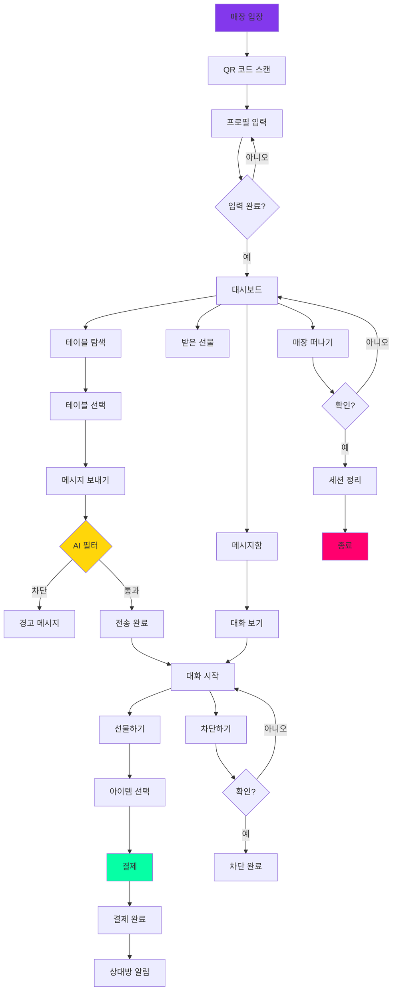
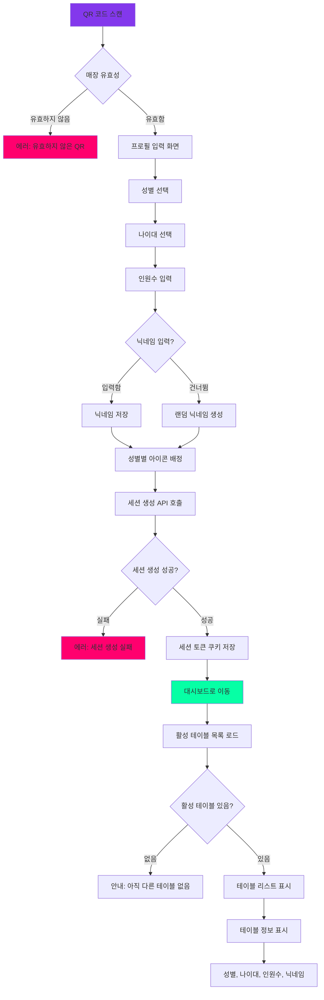
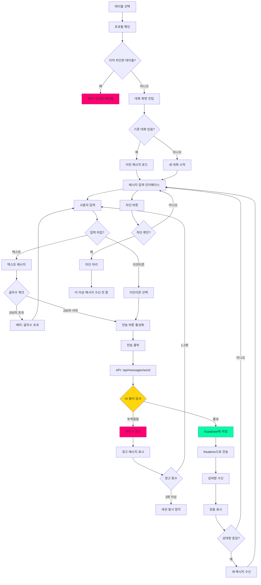
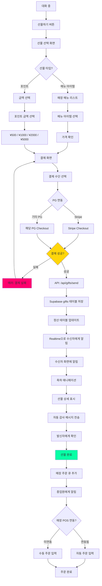
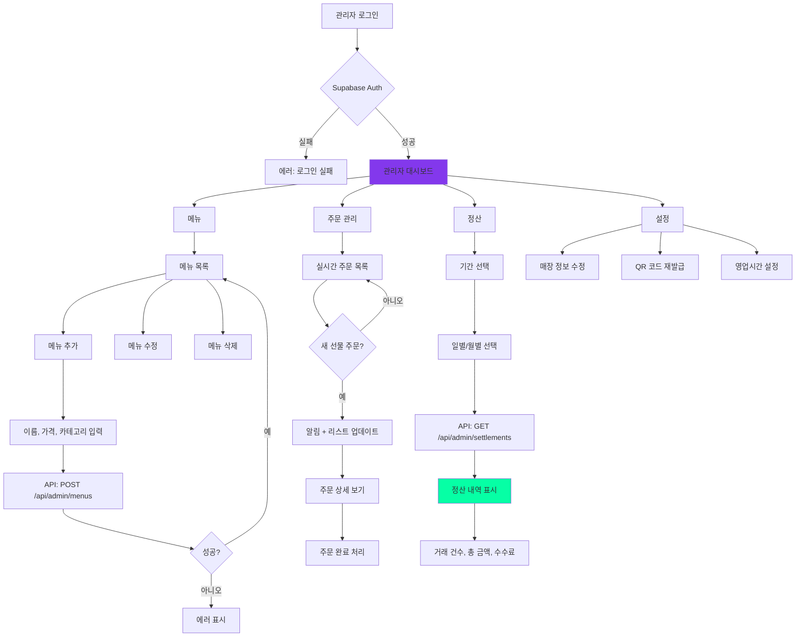
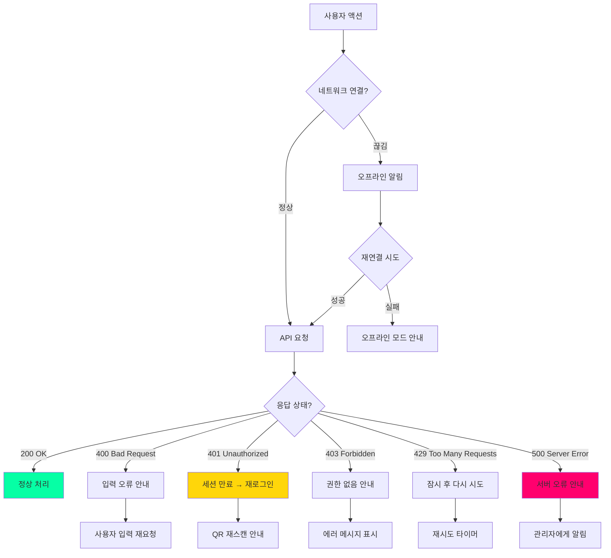
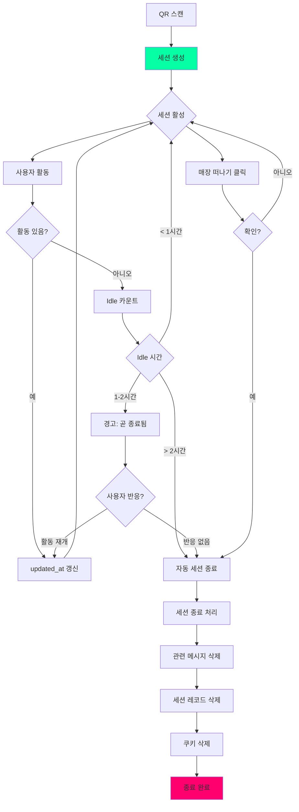
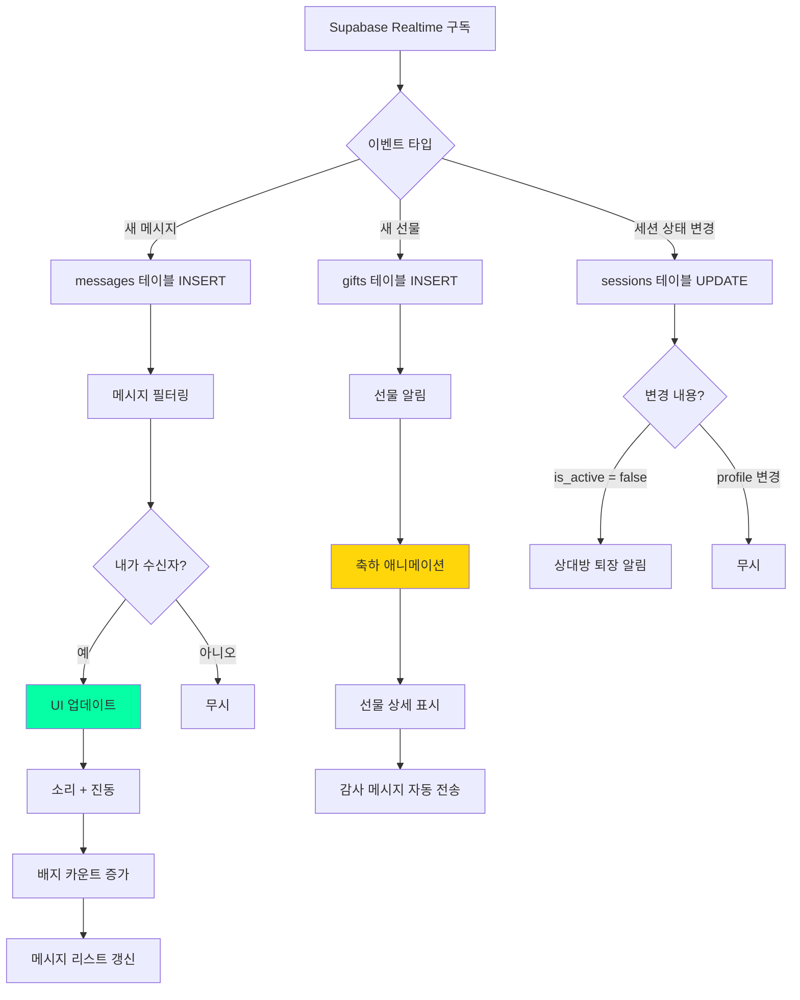
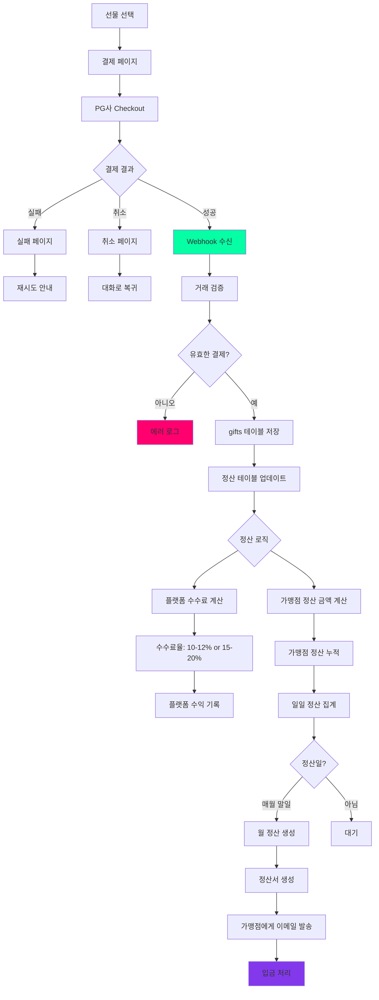
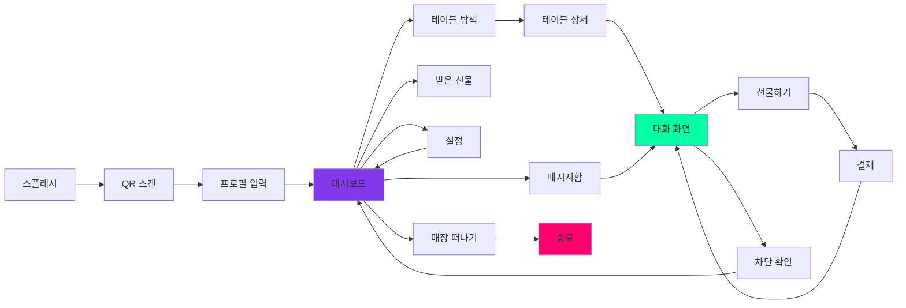

# User Flow (사용자 흐름도)

# Table Connect - 사용자 흐름도 (User Flow)

**버전:** v1.0

**작성일:** 2026년 1월 18일

**참조 문서:** PRD v1.0, TRD v1.1

---

## 1. 개요

본 문서는 Table Connect의 주요 사용자 여정을 시각화한 플로우차트입니다. Mermaid 다이어그램을 사용하여 각 기능의 흐름을 표현합니다.

---

## 2. 전체 서비스 플로우



---

## 3. [FEAT-1] 테이블 연결 플로우



### 3.1 프로필 입력 상세

**필수 입력:**

1. 성별 (남성/여성) - 버튼 선택
2. 나이대 (20대 초반/중반/후반, 30대 초반/중반/후반, 40대) - 드롭다운
3. 인원수 (1-10명) - 숫자 입력

**선택 입력:**
4. 닉네임 - 텍스트 입력 (최대 10자)

- 미입력 시: 랜덤 닉네임 (예: "푸른사슴", "빨간여우")

**자동 생성:**
5. 아이콘 - 성별에 따라 자동 배정

---

## 4. [FEAT-2] 익명 메시징 플로우



### 4.1 메시지 타입

**텍스트 메시지:**

- 최소 1자, 최대 200자
- 특수문자 허용
- URL 자동 링크 변환 (선택적)

**이모티콘:**

- 기본 이모티콘 팩 제공
- Unicode 이모지 지원

**정형 메시지 (Quick Reply):**

- "안녕하세요! 🍻"
- "건배! 🥂"
- "즐거운 시간 보내세요 ✨"
- "감사합니다 🙏"

---

## 5. [FEAT-3] 선물하기 플로우



### 5.1 선물 옵션

**메뉴 아이템:**

- 매장이 등록한 메뉴에서 선택
- 가격 표시
- 이미지 (있는 경우)
- 카테고리: 술, 안주, 디저트 등

**포인트:**

- 고정 금액: ¥500, ¥1000, ¥2000, ¥5000
- 수신자가 자유롭게 사용 가능

### 5.2 결제 흐름

1. 선물 선택
2. 결제 정보 입력 (일회성, 저장 안 함)
3. PG사 결제 처리
4. 결제 완료 → Webhook
5. DB에 거래 기록
6. 수신자에게 실시간 알림

---

## 6. 관리자 플로우 (가맹점)



---

## 7. 에러 및 예외 처리 플로우



---

## 8. 세션 생명주기



---

## 9. 실시간 알림 플로우



---

## 10. 보안 및 필터링 플로우

```mermaid
graph TD
    A[메시지 전송 요청] --> B[프론트엔드 검증]
    B --> C{길이 체크}
    C -->|200자 초과| D[에러: 글자수 초과]
    C -->|정상| E[API 전송]

    E --> F[백엔드 검증]
    F --> G{세션 유효?}
    G -->|아니오| H[401 Unauthorized]
    G -->|예| I{차단된 사용자?}
    I -->|예| J[403 Forbidden]
    I -->|아니오| K[AI 필터 호출]

    K --> L[OpenAI Moderation API]
    L --> M{부적절 판정?}

    M -->|예| N[카테고리 확인]
    N --> O{심각도}
    O -->|경미| P[1차 경고]
    O -->|중간| Q[2차 경고]
    O -->|심각| R[즉시 세션 정지]

    P --> S[경고 횟수 기록]
    Q --> S
    S --> T{누적 경고}
    T -->|< 3회| U[경고 메시지 표시]
    T -->|>= 3회| R

    M -->|아니오| V[Supabase 저장]
    V --> W[Realtime 전송]

    R --> X[관리자에게 알림]
    X --> Y[세션 블록 (24시간)]

    style R fill:#FF006E
    style W fill:#06FFA5
    style L fill:#FFD60A

```

---

## 11. 결제 및 정산 플로우



---

## 12. 주요 화면 전환 흐름



---

## 13. 플로우 요약

### 13.1 핵심 사용자 여정

1. **온보딩:** QR 스캔 → 프로필 입력 (30초)
2. **탐색:** 테이블 리스트 확인 → 관심 테이블 선택
3. **소통:** 메시지 전송 → 실시간 대화
4. **선물:** 선물 선택 → 결제 → 축하 애니메이션
5. **퇴장:** 매장 떠나기 → 세션 정리

### 13.2 평균 소요 시간

- 온보딩: 30초
- 메시지 작성/전송: 10초
- 선물하기: 1-2분
- 전체 세션: 30분-2시간

### 13.3 주요 의사결정 지점

- 프로필 입력 완료 여부
- 메시지 전송 전 AI 필터 통과
- 선물 결제 성공/실패
- 차단 확인
- 세션 종료 확인

---

**문서 작성자:** wj

**문서 버전:** v1.0

**최종 수정일:** 2026-01-18